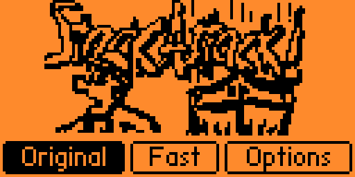
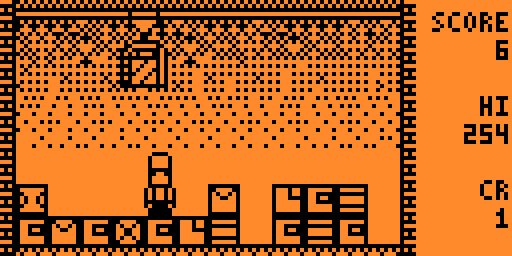
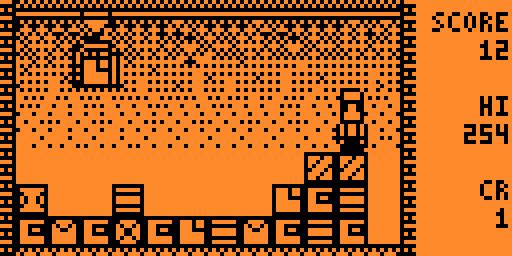
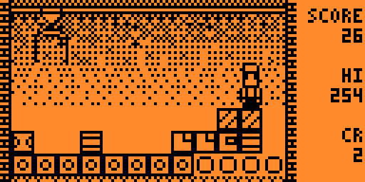

# Stack Attack for Flipper Zero

**Stack Attack**, rebuilt to feel like when you were at school playing it on your Siemens
(C35, C45, A50, M50 and others had it built in).

 
 


## How to play

You know how to play, don't you?

| Button | Action |
| --- | --- |
| Left / Right | Walk, push a crate |
| Up or OK | Jump |
| Back | Pause (Continue, Options, Menu) |
| Hold Back | Quit |

Two modes: **Original** and **Fast**.

**Modern perks:** LED and a bit more modern vibro. Both, as well as sound, can be switched off in
Options.

## About this remake

This is a fan remake written from scratch. No code from the original was used: the rules,
timings, graphics and sounds were reconstructed from gameplay of a real phone and
from other open-source remakes. It is not affiliated with or endorsed by Siemens.

## Credits

- Original game: Siemens.
- Rules and sound timings cross-checked with [eaun01re/stktk](https://github.com/eaun01re/stktk),
  a remake built by watching the original.
- Reference footage: [Siemens C45 gameplay](https://www.youtube.com/watch?v=cjh7mMdTulk) and an
  [Android demake](https://www.youtube.com/watch?v=J947j2_N60Y).
- [Heap Defence](https://lab.flipper.net/apps/heap_defence), the earlier Flipper take on the game.

## Boring technical details

- Original runs at 15 frames per second with one crane, like the phone; Fast runs at 20 with
  two. Every cleared row adds a crane, up to 5.
- Score: 2 points per crate a crane drops, 10 times the number of cranes for a cleared row.
- Settings and high scores are saved to `/ext/apps_data/stack_attack/`.

### Building

```sh
ufbt                  # build
ufbt launch           # build, install and run on a connected Flipper
```

Graphics live as ASCII art in `art/`; after editing them run `python3 tools/gen_sprites.py`.
The game logic (`game.c`) and renderer (`render.c`) have no Flipper dependencies and run on a
computer:

```sh
cc -I. tests/test_game.c game.c -o /tmp/t && /tmp/t          # rule tests
cc -I. tests/preview.c game.c render.c -o /tmp/p && /tmp/p .  # renders frames as PBM
```

## License

MIT, see [LICENSE](LICENSE).
